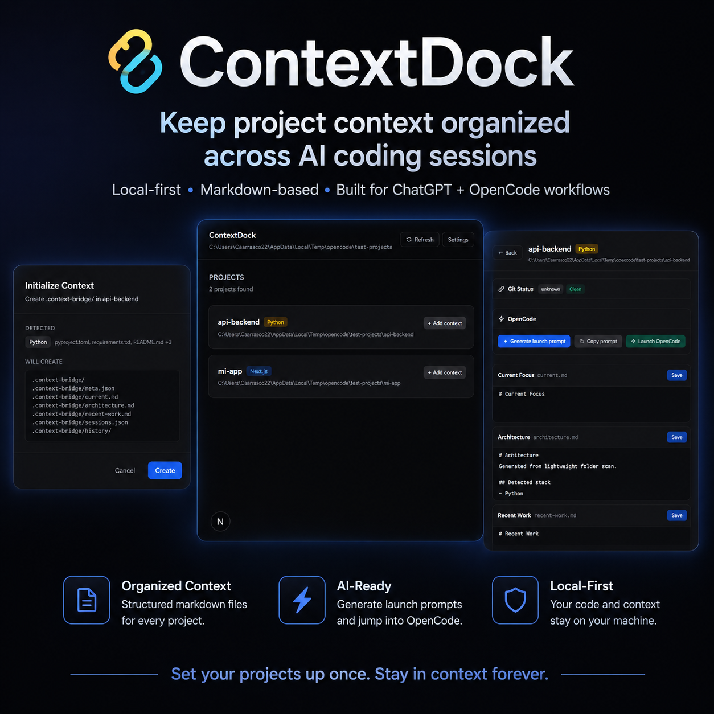

<p align="center">
  
  
</p>

<p align="center">
  
  
  
  
  
  
</p>

# ContextDock

A lightweight local desktop app that keeps persistent project context and bridges **ChatGPT** with **OpenCode** so AI coding sessions continue from where they left off.

<p align="center">
  
</p>

## The problem

When working on a project across multiple ChatGPT and OpenCode sessions, context is constantly lost — you have to re-explain your architecture, goals, and recent changes every time.

## The solution

ContextDock sits between ChatGPT (strategy & planning) and OpenCode (code execution). It scans your local projects, generates a persistent `.context-bridge/` folder with structured markdown context, and produces a `launch-prompt.md` that you can feed to OpenCode for informed, contextualized coding sessions.

```
ChatGPT  ──►  ContextDock  ──►  .context-bridge/  ──►  launch-prompt.md  ──►  OpenCode
(strategy)    (context manager)       (persistent state)       (generated prompt)     (code execution)
```

## Philosophy

- **Local-first**: Everything runs on your machine. No SaaS, no remote backend, no cloud.
- **Filesystem-first**: Context is plain Markdown + JSON. Human-readable, versionable, portable.
- **Lightweight**: No databases, no heavy indexing, no agents running autonomously.
- **Manual control**: You decide when to generate prompts, when to launch OpenCode, what to edit.

## Tech Stack

| Layer | Technology |
|-------|-----------|
| Frontend | Next.js 16 (App Router), React 19 |
| Styling | Tailwind CSS 4 |
| State | Zustand |
| Desktop Shell | Tauri 2.x |
| Backend | Rust (Tauri commands) |
| Language | TypeScript 5 |
| Storage | Markdown + JSON files (no database) |

## Current Features

- [x] **Dashboard** with project list from a configurable root folder
- [x] **Project type detection** — Next.js, Node, Python, Rust, Unknown
- [x] **`.context-bridge/` initialization** with preview modal and `.gitignore` integration
- [x] **Context file editors** — edit `current.md`, `architecture.md`, `recent-work.md` inline
- [x] **Launch prompt generation** — produces `launch-prompt.md` with Current Goal, Architecture, Recent Work, Git Status, Recent Commits, and a useful Requested Task
- [x] **Git panel** — branch, staged/modified/untracked files, recent commits
- [x] **Settings persistence** — root projects path and OpenCode command saved locally
- [x] **Frontend-only mode** — graceful degradation when Tauri is unavailable
- [x] **Error handling** — safe fallbacks for missing paths, permission errors, uninitialized context

## Known Limitations

- **OpenCode launcher is cross-platform** — supports Windows, macOS, and Linux
- **Session capture not yet implemented** — `sessions.json` and `history/` exist but are not populated
- This is an **experimental MVP** — expect rough edges

## Roadmap

See [docs/ROADMAP.md](docs/ROADMAP.md) for the full plan.

## Prerequisites

- **Node.js** ≥ 18
- **Rust** (required for Tauri backend)

Install Rust:
```powershell
# Windows
winget install -e --id Rustlang.Rustup

# macOS / Linux
curl --proto '=https' --tlsv1.2 -sSf https://sh.rustup.rs | sh
```

Verify:
```bash
cargo --version
```

## Setup & Development

```bash
cd contextdock
npm install
```

### Frontend only (no Rust)
```bash
npm run dev
# → http://localhost:3000
```
A banner indicates limited functionality when running without Tauri.

### Full desktop app
```bash
npm run tauri:dev
```

### Build
```bash
npm run build        # Frontend
cargo check          # Rust (from src-tauri/)
cargo test           # Rust tests
```

## Project Structure

```
contextdock/
├── app/                        # Next.js App Router
│   ├── components/             # ProjectCard, InitPreviewModal, SettingsDrawer
│   ├── lib/                    # TypeScript types + Tauri command bindings
│   ├── project/[id]/           # Standalone project detail page
│   ├── settings/               # Standalone settings page
│   ├── stores/                 # Zustand stores (settings, projects)
│   ├── globals.css             # Tailwind + CSS variables
│   ├── layout.tsx              # Root layout (dark theme)
│   └── page.tsx                # Main dashboard
├── src-tauri/                  # Tauri + Rust backend
│   ├── src/
│   │   ├── commands/
│   │   │   ├── projects.rs     # Scan, init, read/write context files
│   │   │   ├── settings.rs     # Load/save app settings
│   │   │   ├── git.rs          # Git info (branch, status, commits)
│   │   │   ├── opencode.rs     # Prompt generation + OpenCode launch
│   │   │   └── git_tests.rs    # Unit tests
│   │   ├── lib.rs              # Tauri app setup, command registration
│   │   └── main.rs             # Binary entry point
│   ├── Cargo.toml
│   └── tauri.conf.json         # Window config, bundle, icons
├── docs/                       # Documentation
│   ├── PROJECT_OVERVIEW.md     # Technical architecture
│   ├── ROADMAP.md              # Future plans
│   └── dev-checklist.md        # Manual testing checklist
├── package.json
├── next.config.ts
├── tsconfig.json
└── README.md
```

## `.context-bridge/` Folder

Each project gets a portable, human-readable context folder:

| File | Purpose |
|------|---------|
| `meta.json` | Project metadata (name, path, type, timestamps, favorite) |
| `current.md` | Current focus — what you're working on now |
| `architecture.md` | Project structure (auto-generated on init, editable) |
| `recent-work.md` | Summary of recent sessions |
| `sessions.json` | Session history array |
| `launch-prompt.md` | Generated context prompt for OpenCode |
| `history/` | Session prompt snapshots |

The folder is added to `.gitignore` automatically when the project has a `.git` directory.

## License

MIT — see [LICENSE](LICENSE) for details.
